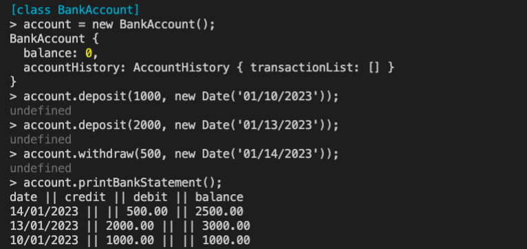

# Bank tech test

This is the first tech test for week 10 at Makers Academy.

This code will simulate a bank account, where you'll be able to deposit/withdraw money, check your balance and print out a bank statement.

## How to run

- clone this repo `git@github.com:GianlucaAnsaldi/bank-tech-task.git`
- install dependencies `npm install`
- navigate to the repository `cd src`
- launch Node.js REPL on the terminal `node`
- load the bankAccount.js file `.load bankAccount.js`

## How to test

- clone and install dependencies like in the previous steps
- run tests in the terminal with `npm test`

## Preview

<div style="text-align:center"></div>

## Requirements

- You should be able to interact with your code via a REPL like IRB or the JavaScript console. (You don't need to implement a command line interface that takes input from STDIN.)
- Deposits, withdrawal.
- Account statement (date, amount, balance) printing.
- Data can be kept in memory (it doesn't need to be stored to a database or anything).

## Acceptance criteria

**Given** a client makes a deposit of 1000 on 10-01-2023  
**And** a deposit of 2000 on 13-01-2023  
**And** a withdrawal of 500 on 14-01-2023  
**When** she prints her bank statement  
**Then** she would see

```
date || credit || debit || balance
14/01/2023 || || 500.00 || 2500.00
13/01/2023 || 2000.00 || || 3000.00
10/01/2023 || 1000.00 || || 1000.00
```

## User stories

```
As a customer
so that I can avoid carrying cash around
I would like to be able to open a bank account
```

```
As a customer
so that I can store away cash that I'm not using
I would like to be able to deposit money on my account
```

```
As a customer
so that I can get some cash when I need it
I would like to be able to withdraw money from my account
```

```
As a customer
so that I can see how much money I have into my account
I would like to be able to check my balance
```

```
As a customer
so that I can review my transactions
I would like to be able to print a statement
```
## Code structure

The code is split in three different classes:

- BankAccount is the main class, it contains the methods that a user will be able to interact with (deposit, withdraw, showBalance and printBankStatement). It also instantiates the initial balance and an object from the AccountHistory class.

- AccountHistory class is where all the transactions are recorded into an array. I also used this class to format the date for each transaction before pushing it into the array.

- Statement class only purpose is to take responsibilities out of the BankAccount class, so that all the work necessary to print out the statement are done in this class. It have methods to print out the header and the body of the statement, which loops through the array of transactions and check if it should be printed out as a deposit or a withdrawal.
